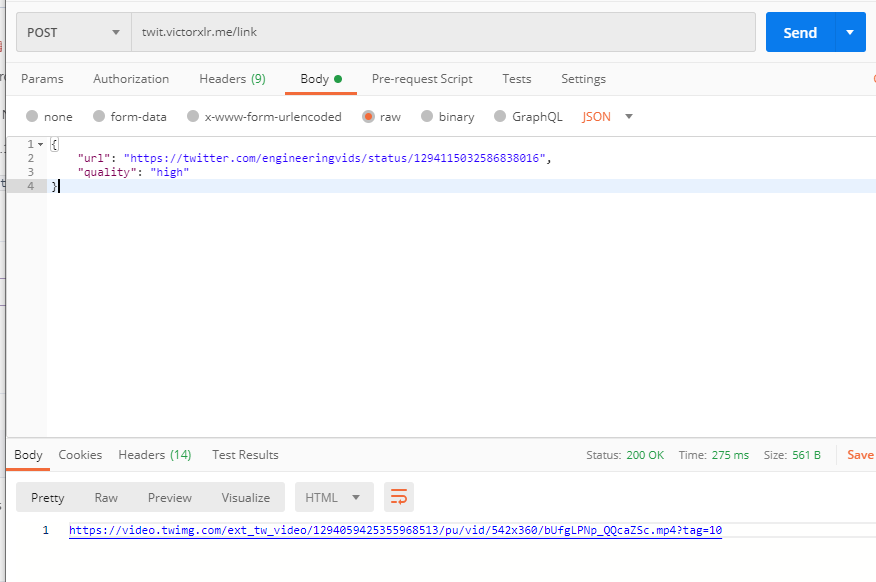

# TwitterDownloader
A quick project to serve mp4 links for apple shortcuts, which allows me to download videos from Twitter.com 


### Generate Token
Create a Twitter developer app using an application's `CONSUMER API KEY` and `CONSUMER API SECRET` keys.. 

Command to run to generate a Bearer Token is 

```bash
curl -u 'API key:API secret key' \
  --data 'grant_type=client_credentials' \
  'https://api.twitter.com/oauth2/token'
```

This App will take a POST request with parameters in the format of 
```json
{
	"url": "https://twitter.com/FreddieGibbs/status/1322028151615021056",
	"quality": "high"
}
```

and return a direct url to the video so it can be saved to my camera roll :)


### It is currently deployed at 

Twitter Endpoints: `dl.victorxlr.me/link`

Non-Twitter Endpoints: `dl.victorxlr.me/bin`


